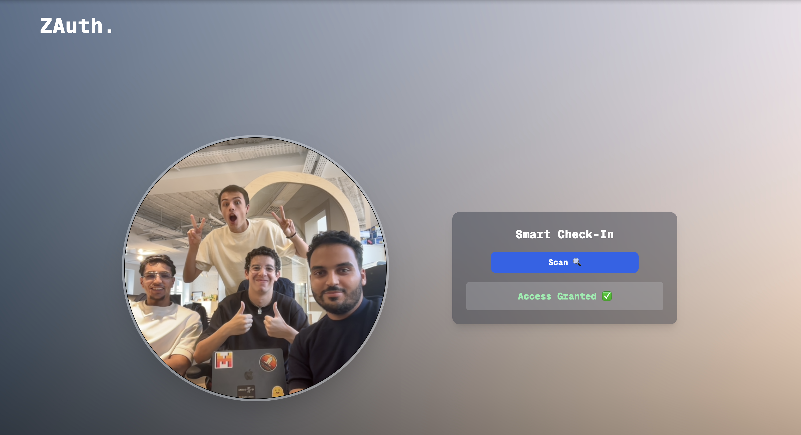
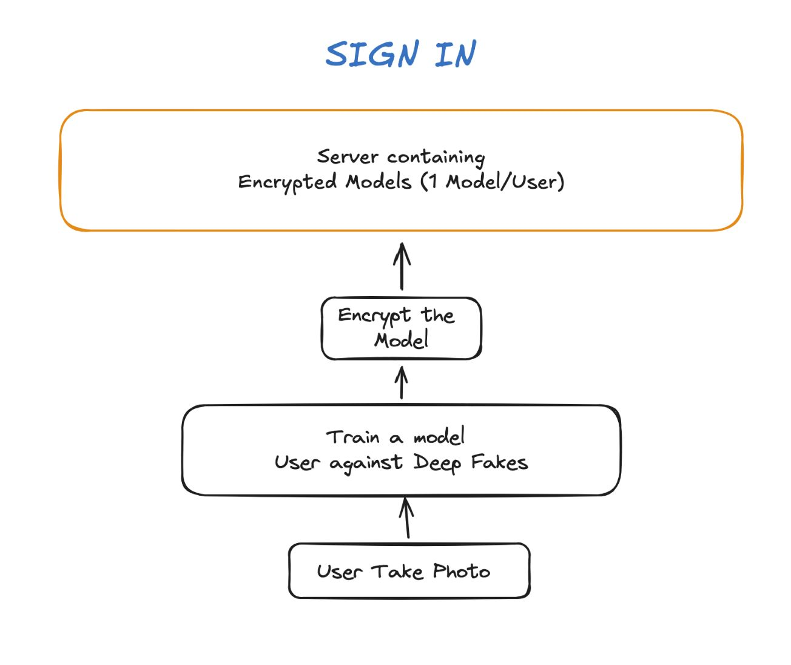
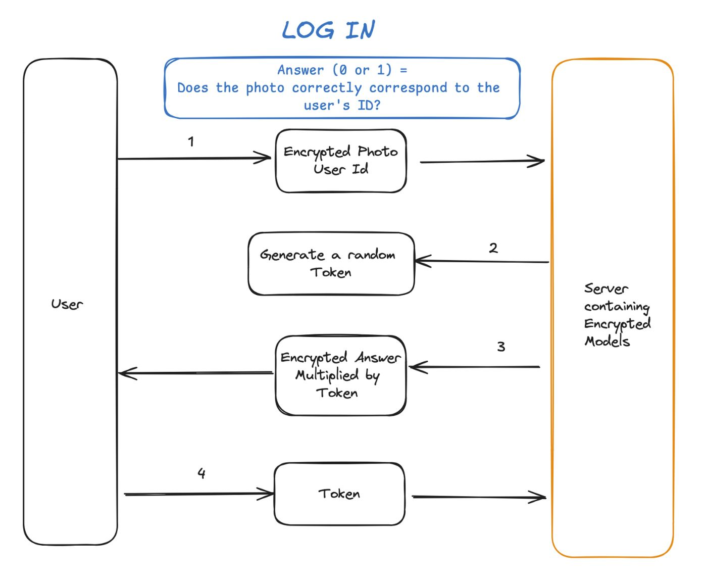

# ZAuth: Secure Face Recognition-Based Two-Factor Authentication Using FHE



## Overview

ZAuth is a secure two-factor authentication system that leverages Fully Homomorphic Encryption (FHE) to ensure user privacy and data security. By combining FHE with face recognition technology, ZAuth allows for user authentication without compromising the confidentiality of sensitive data, including model weights and user embeddings. This system is designed to be secure against reverse engineering attacks and ensures that only the intended user can access their encrypted data.

## Features

- **User Privacy**: Sensitive data such as user embeddings and model weights are kept encrypted at all times on the server, ensuring strong protection against unauthorized access.
- **Fully Homomorphic Encryption (FHE)**: ZAuth uses FHE to enable secure computation on encrypted data without needing to decrypt it, preserving data confidentiality throughout the authentication process.
- **On-Device Processing**: The initial image encoding using the FaceNet model is performed on the user's device, ensuring that raw image data is never transmitted to the server.
- **Model Training**: The server trains a simple logistic regression model using a combination of a deepfake dataset and user-provided images. The model is then encrypted and stored securely on the server.
- **Secure Authentication**: The authentication process uses encrypted user embeddings and encrypted model weights to generate a unique token that confirms the user's identity, all while maintaining encryption.

## Workflow

1. **User Registration**:

   - The user captures a series of images on their device. These images are encoded using the FaceNet model to generate a user embedding.
   - The generated embedding is encrypted using the user's key and transmitted to the server along with the user's ID.
   - If this is a first registration, the server trains a logistic regression model using a deepfake dataset and user-provided images. This training occurs in the clear.
   - The model weights are encrypted and stored on the server, making reverse engineering infeasible.
   - The encrypted weights are mapped to the user's ID in a key-value store.
   

    
2. **User Authentication**:

   - During authentication, the user captures a new image on their device, which is encoded using the FaceNet model.
   - The encoded image is encrypted using the user's key and sent to the server along with the user's ID.
   - The server retrieves the correct encrypted model and performs the face recognition operation on the encrypted data.
   - The server generates an encrypted response and multiplies it by a random value to ensure the user cannot manipulate the response.
   - The encrypted response is sent back to the user, who decrypts it to obtain a unique token.
   - The user sends the decrypted token back to the server for verification. If it matches the expected token, authentication is successful.


    

## Security Considerations

- **Encryption**: All sensitive data, including user embeddings and model weights, is encrypted using Fully Homomorphic Encryption (FHE), ensuring that no raw data is ever exposed.
- **Reverse Engineering**: The encrypted weights are stored in a manner that makes it computationally infeasible to reverse engineer or extract any information about the user's identity or the model itself.
- **Privacy**: Raw image data and user embeddings are processed locally on the user's device, and only encrypted information is transmitted to the server.

## Prerequisites

- Python 3.8+
- [FaceNet Model](https://github.com/davidsandberg/facenet)
- Fully Homomorphic Encryption (FHE) library, e.g., [Concrete ML](https://github.com/zama-ai/concrete-ml)

## Installation

1. Clone the repository:
   ```bash
   git clone https://github.com/your-username/ZAuth.git
   cd ZAuth
   ```
2. Create a isolated environment with python 3.10
3. Install the requirements file:
    ```bash
    pip install -r requirements.txt
    ```
4. Run the server:
    ```bash
    python -m server.main
    ```
5. Run the client:
   ```bash
   python -m client.main
   ```
6. Connect to your localhost with the port 7860 and try to register yourself!

   ```
